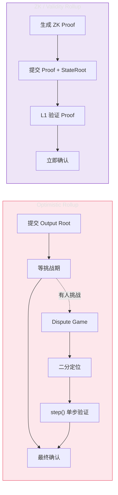

# L2→L1 Rollup 全流程详解

> 基于以太坊 Rollup 架构，从用户发起交易到 L1 最终确认的完整链路。标注每一步的操作、关键数据变化和验证逻辑。

---

## 总览流程图

```mermaid
flowchart TB
    subgraph PHASE1["🔵 阶段一：L2 交易收集"]
        direction TB
        A1["👤 用户 A 构造 L2 交易<br/>━━━━━━━━━━━━━━━<br/>• to: B 地址 / 合约地址<br/>• value / calldata<br/>• nonce_A_L2<br/>• gas 参数<br/>• chainId = L2"] 
        A2["✍️ 用户 A 用私钥签名交易"]
        A3["📡 广播到 L2 Sequencer 节点"]
        A4["📥 L2 Mempool<br/>━━━━━━━━━━━━━━━<br/>收集多个用户的待处理交易<br/>Tx1, Tx2, Tx3 ... TxN"]
        
        A1 --> A2 --> A3 --> A4
    end

    subgraph PHASE2["🟢 阶段二：L2 排序、出块 & 执行"]
        direction TB
        B1["🔀 Sequencer 对交易排序<br/>━━━━━━━━━━━━━━━<br/>决定 L2 区块内的交易顺序<br/>（中心化 Sequencer 或<br/>共享排序 / Based Rollup）"]
        B2["⚙️ L2 Execution Engine 执行交易<br/>━━━━━━━━━━━━━━━<br/>Sequencer 驱动出块，op-geth / EVM<br/>按顺序执行每笔 Tx：<br/>① 验证签名 & nonce<br/>② 扣 gas（从 A 余额）<br/>③ transfer：A.balance--  B.balance++<br/>④ 合约调用：修改合约 storage<br/>⑤ emit 事件日志"]
        B3["📦 产出 L2 Block<br/>━━━━━━━━━━━━━━━<br/>• L2 block number N+1<br/>• L2 block hash<br/>• 交易列表 [Tx1..TxN]<br/>• 交易 receipts（含 event logs）<br/>• L2 stateRoot（新状态根）<br/>• withdrawalRoot<br/>• 上一 block hash"]
        B4["📤 op-batcher 发布 Batch 到 L1<br/>━━━━━━━━━━━━━━━<br/>op-batcher 读取 L2 blocks，<br/>把可重放的 L2 交易数据压缩后提交到 L1：<br/>方式①：L1 calldata<br/>方式②：L1 blob（EIP-4844）<br/>━━━━━━━━━━━━━━━<br/>关键数据变化：<br/>L1 区块数据中出现<br/>这批 L2 输入数据"]
        
        B1 --> B2 --> B3 --> B4
    end

    subgraph PHASE3["🟡 阶段三：Rollup 状态承诺提交到 L1"]
        direction TB
        
        C1["📋 op-proposer 构造 Output Root<br/>━━━━━━━━━━━━━━━<br/>proposer 监听 L1 / L2，<br/>针对某个 L2 高度计算：<br/>outputRoot = hash(<br/>  L2 stateRoot +<br/>  withdrawalRoot +<br/>  latest L2 blockHash<br/>）<br/>━━━━━━━━━━━━━━━<br/>这是对「L2 执行结果」<br/>的密码学承诺"]
        
        C2{"🔀 Rollup 协议采用哪种确认机制？"}
        
        C1 --> C2
    end

    subgraph OPTI["🟠 路径 A：Optimistic Rollup"]
        direction TB
        D1["📬 Proposer 提交 Output Root 到 L1<br/>━━━━━━━━━━━━━━━━━<br/>调用 L1 合约记录：<br/>• outputRoot<br/>• L2 block number<br/>• 时间戳<br/>━━━━━━━━━━━━━━━━━<br/>关键数据变化：<br/>L1 合约 storage 中新增<br/>一个待确认的 output proposal"]
        D2["⏳ 挑战期开始<br/>━━━━━━━━━━━━━━━━━<br/>常见设计：约 7 天<br/>部分新方案目标是缩短确认时间<br/>━━━━━━━━━━━━━━━━━<br/>期间任何人都可以<br/>挑战这个 output claim"]
        D3{"👀 有人挑战吗？"}
        
        D1 --> D2 --> D3
    end

    subgraph FDG["🔴 Fault Dispute Game（争议游戏）"]
        direction TB
        E1["⚔️ Challenger 发起 Attack<br/>━━━━━━━━━━━━━━━━━<br/>声称某个 output root 错误<br/>提交 bond（质押金）"]
        E2["🔄 二分争议（Bisection）<br/>━━━━━━━━━━━━━━━━━<br/>双方交互式缩小分歧范围：<br/>① 从 anchor output root<br/>   到 claimed output root 的区间开始<br/>② 二分定位到某个 L2 block transition<br/>③ 再二分到单条 FPVM 指令<br/>━━━━━━━━━━━━━━━━━<br/>每次提交更细粒度的<br/>trace/state commitment"]
        E3["🔬 定位到单步指令<br/>━━━━━━━━━━━━━━━━━<br/>最终争议点：<br/>某条 VM 指令前后的<br/>pre-state → post-state<br/>是否按规则正确转换"]
        E4["⚖️ L1 合约调用 step()<br/>━━━━━━━━━━━━━━━━━<br/>L1 只验证这一个 VM step：<br/>• 输入 pre-state<br/>• 执行单条指令<br/>• 检查 post-state<br/>━━━━━━━━━━━━━━━━━<br/>赢家拿回 bond + 对手的 bond<br/>输家 bond 被没收"]
        
        E1 --> E2 --> E3 --> E4
    end

    subgraph ZK["🟣 路径 B：ZK / Validity Rollup"]
        direction TB
        F1["🔐 Prover 生成有效性证明<br/>━━━━━━━━━━━━━━━━━<br/>把 L2 derivation + execution<br/>编码为可验证计算：<br/>① 从 L1 batch/deposit 数据推导 L2 输入<br/>② 按 EVM / rollup 规则执行<br/>③ 生成 ZK-SNARK/STARK 证明<br/>━━━━━━━━━━━━━━━━━<br/>证明内容：<br/>「从已知 pre-state 出发，<br/>按协议执行到 claimed post-state」"]
        F2["📤 提交 Proof 到 L1 Verifier<br/>━━━━━━━━━━━━━━━━━<br/>调用 L1 验证合约：<br/>传入 proof + public inputs<br/>（如 old/new stateRoot 或 output root）<br/>━━━━━━━━━━━━━━━━━<br/>关键数据变化：<br/>L1 合约 storage 中<br/>记录已验证的状态承诺"]
        F3["✅ L1 Verifier 验证 Proof<br/>━━━━━━━━━━━━━━━━━<br/>链上验证计算（~几百k gas）：<br/>• 配对检查（SNARK）<br/>• 或 FRI 验证（STARK）<br/>━━━━━━━━━━━━━━━━━<br/>验证通过 → 立即接受<br/>（无需挑战期！）"]
        
        F1 --> F2 --> F3
    end

    subgraph PHASE4["🔷 阶段四：多笔 L1 交易与最终结算"]
        direction TB
        G1["📦 L1 分阶段打包相关交易<br/>━━━━━━━━━━━━━━━<br/>这些交易通常出现在不同 L1 区块中：<br/>• batcher tx：发布 L2 输入数据<br/>• proposer tx：提交 output root / proof<br/>• challenge / step tx：争议时才出现<br/>• finalize withdrawal tx：提款时出现"]
        G2["⚙️ L1 节点执行 L1 交易<br/>━━━━━━━━━━━━━━━<br/>L1 执行的是 L1 合约逻辑：<br/>① 记录 batch 数据或 blob commitment<br/>② 记录 / 验证状态承诺<br/>③ 验证 ZK proof（ZK 路径）<br/>④ 验证 step()（Opti 争议路径）<br/>⑤ 更新 L1 合约 storage"]
        G3["🔗 L1 自身状态更新<br/>━━━━━━━━━━━━━━━<br/>每个 L1 区块都会更新：<br/>• L1 stateRoot<br/>  → L1 合约 storage 变更<br/>  → L1 账户余额 / bond 变更<br/>• transactionsRoot<br/>• receiptsRoot<br/>• parentHash"]
        G5["✅ 挑战失败 / 无挑战<br/>━━━━━━━━━━━━━━━<br/>L1：output root 保留，<br/>可进入提款/结算逻辑<br/>L2：节点继续按 canonical L1<br/>数据推导和执行"]
        G6["❌ 挑战成功<br/>━━━━━━━━━━━━━━━<br/>L1：output root 被判无效，<br/>错误方 bond 被罚，相关提款不能 finalize<br/>L2：不接收 L1 回滚命令，<br/>继续跟随 canonical L1 derivation；<br/>错误 unsafe view 会被丢弃"]
        G4["🏁 L2 状态承诺可用于结算<br/>━━━━━━━━━━━━━━━<br/>• Optimistic：output root 过挑战期<br/>  或 dispute 裁决后可被接受<br/>• ZK：proof 验证通过后状态承诺被接受<br/>━━━━━━━━━━━━━━━<br/>后续：L2→L1 提款可执行<br/>桥合约基于已接受承诺释放资产"]
        
        G1 --> G2 --> G3 --> G4
        G5 --> G4
    end

    A4 --> B1
    B4 --> C1
    C2 -->|"Optimistic<br/>默认接受，错误时挑战"| OPTI
    C2 -->|"ZK / Validity<br/>先证明，后接受"| ZK
    
    D3 -->|"无挑战：挑战期结束"| G5
    D3 -->|"有挑战 ❌"| FDG
    E4 -->|"挑战成功：output root 被推翻"| G6
    E4 -.->|"挑战失败：output root 保留"| G5
    F3 -->|"proof 通过"| G4

    style PHASE1 fill:#1a1a2e,stroke:#16213e,color:#e0e0e0
    style PHASE2 fill:#0f3460,stroke:#16213e,color:#e0e0e0
    style PHASE3 fill:#533483,stroke:#16213e,color:#e0e0e0
    style OPTI fill:#e94560,stroke:#c23152,color:#fff
    style FDG fill:#ff6b6b,stroke:#c23152,color:#fff
    style ZK fill:#7b2fbe,stroke:#5a1e8a,color:#fff
    style PHASE4 fill:#1a1a2e,stroke:#0f3460,color:#e0e0e0
```



---

## 逐阶段关键数据变化对照表

### 阶段一：L2 交易收集

| 步骤 | 做什么 | 产生/变化的关键数据 | 数据位置 |
|------|--------|---------------------|----------|
| 用户构造交易 | 指定 to、value、calldata、nonce、gas | `tx{nonce, to, value, data, gas, chainId}` | 用户本地 |
| 用户签名 | 用私钥对交易 hash 签名 | `signature(r, s, v)` → 可恢复 `from` 地址 | 用户本地 |
| 广播到 Sequencer | 发送已签名交易 | Mempool 中新增待处理交易 | L2 Sequencer 内存 |
| Mempool 收集 | 收集多个用户交易 | `[SignedTx1, SignedTx2, ...]` | L2 Sequencer 内存 |

### 阶段二：L2 排序、出块 & 执行

| 步骤 | 做什么 | 产生/变化的关键数据 | 数据位置 |
|------|--------|---------------------|----------|
| Sequencer 排序 | 决定 L2 区块内交易顺序 | 有序交易列表 | L2 Sequencer |
| Execution Engine 执行 | op-geth / EVM 按 sequencer 给出的顺序运行交易 | 每笔交易后：<br/>• `A.balance -= value + gas`<br/>• `B.balance += value`<br/>• `A.nonce += 1`<br/>• 合约 `storage[slot]` 变更<br/>• 事件日志 `topics + data` | L2 状态树 |
| 产出 L2 Block | 生成区块 | • `L2 block number` ↑<br/>• `L2 stateRoot`（所有账户状态 Merkle 根）<br/>• `withdrawalRoot`（提款消息 Merkle 根）<br/>• `transactionsRoot`<br/>• `receiptsRoot`<br/>• `parentBlockHash` | L2 节点本地 DB |
| 发布 Batch 到 L1 | op-batcher 把可重放的 L2 输入数据写到 L1 | L1 区块的 `calldata` 或 `blob` 中出现 L2 交易数据 | L1 区块数据 |

### 阶段三-A：Optimistic Rollup 状态承诺

| 步骤 | 做什么 | 产生/变化的关键数据 | 数据位置 |
|------|--------|---------------------|----------|
| 构造 Output Root | proposer 针对某个 L2 高度哈希多个状态承诺 | `outputRoot = keccak256(stateRoot ‖ withdrawalRoot ‖ blockHash)` | op-proposer / proposer |
| 提交到 L1 合约 | 调用合约记录承诺 | L1 合约 storage：新增 `proposal{outputRoot, l2BlockNumber, timestamp}` | L1 合约 storage |
| 挑战期等待 | N 天窗口 | 时间流逝（传统 7 天） | — |
| (如有挑战) Attack | Challenger 质押并发起 | `bond` 锁定在 L1 合约 | L1 合约 balance |
| 二分争议 | 双方从 output root 区间逐步缩小到单个 L2 block transition，再缩小到 FPVM 单步 | 每次提交：更细粒度的 `trace/state commitment` + `position (gindex)` | L1 合约 storage |
| 定位单步 | 找到具体 VM 指令 | `pre-state hash`, `post-state hash`, 指令 `opcode + operands` | L1 合约 |
| `step()` 验证 | L1 执行单条 VM 指令 | 验证通过 → 错误方 bond 没收给正确方<br/>验证失败 → 反之 | L1 合约 balance → challenger/proposer |

### 阶段三-B：ZK / Validity Rollup 状态承诺

| 步骤 | 做什么 | 产生/变化的关键数据 | 数据位置 |
|------|--------|---------------------|----------|
| Prover 生成 Proof | 把 L2 执行轨迹编码成 ZK 证明 | `π (proof)`: 几百字节～几 KB 的 SNARK/STARK 证明 | Prover 机器 |
| 提交到 L1 Verifier | 调用验证合约 | 合约 storage：记录已验证的 `stateRoot` / `outputRoot` | L1 合约 storage |
| L1 验证 Proof | 链上做配对检查 / FRI 等验证 | 验证结果：✅ 通过 / ❌ 拒绝<br/>（通过则接受状态承诺） | L1 EVM 执行中 |

### 阶段四：多笔 L1 交易与最终结算

| 步骤 | 做什么 | 产生/变化的关键数据 | 数据位置 |
|------|--------|---------------------|----------|
| L1 分阶段打包 | 以太坊 proposer 在不同区块中打包相关 L1 交易 | batcher tx、output proposal tx、proof tx、challenge tx、withdrawal finalize tx | L1 区块体 |
| 所有 L1 节点执行验证 | 重放 L1 区块内的 L1 交易 | • 验证 proof / step()<br/>• 更新 L1 合约 storage<br/>• 更新 L1 账户余额 / bond | 各 L1 节点 |
| 更新 L1 区块头 | 每个 L1 区块都产出新区块头 | • `stateRoot`（L1 全局状态 Merkle 根）<br/>• `transactionsRoot`<br/>• `receiptsRoot`<br/>• `parentHash` | L1 区块头 |
| L2 状态承诺可用于结算 | output root / state root 被 L1 rollup 合约接受 | • 桥合约可释放 L2→L1 提款<br/>• 该 L2 状态承诺进入结算逻辑 | L1 rollup / bridge 合约 |
| 挑战失败 / 无挑战 | L1 接受或保留该 output root | output root 可作为提款和结算依据；L2 节点继续正常推导和执行 | L1 rollup 合约 / L2 节点 |
| 挑战成功 | L1 拒绝该 output root | 错误方 bond 被罚；该 output root 不能用于提款；L2 继续跟随 canonical L1 derivation | L1 dispute 合约 / L2 节点 |

---

## 关键概念速查

| 概念 | 一句话解释 |
|------|-----------|
| **Sequencer** | L2 的交易排序者，负责收集交易、排序并驱动快速出块 |
| **Execution Engine** | 执行 L2 交易的引擎，例如 OP Stack 中的 `op-geth` |
| **op-batcher** | 读取 L2 block 数据，把可重放的 L2 输入发布到 L1 |
| **Batch** | 发布到 L1 的 L2 交易数据包（存在 calldata 或 blob 中） |
| **op-proposer** | 计算并向 L1 提交某个 L2 高度的 output root |
| **Output Root** | 对 L2 执行结果的承诺，= hash(stateRoot, withdrawalRoot, blockHash) |
| **State Root** | L2 所有账户状态的 Merkle Patricia Trie 根哈希 |
| **Withdrawal Root** | OP Stack 中通常指 L2ToL1MessagePasser 的 storage root，用于在 L1 验证提款 |
| **Unsafe L2 Block** | sequencer 先给出的快速 L2 block，还没有被 L1 batch 数据确认 |
| **Safe L2 Block** | 能从当前 canonical L1 数据推导出来的 L2 block |
| **Finalized L2 Block** | 依赖的 L1 数据已经 finalized 的 L2 block |
| **Challenge Period** | Optimistic Rollup 中留给他人提交欺诈证明的时间窗口 |
| **Fraud Proof / Fault Proof** | Optimistic 中证明某个 output root 错误的证据 |
| **Validity Proof / ZK Proof** | ZK Rollup 中随状态提交的密码学正确性证明 |
| **Fault Dispute Game** | Optimism 的交互式争议协议：二分定位→单步验证→结算 |
| **Bond** | 争议双方质押的保证金，输家被没收给赢家 |
| **step()** | FDG 的最终结算函数，L1 只验证一条 VM 指令 |
| **Blob** | EIP-4844 引入的廉价临时数据空间，专供 L2 提交 batch 数据 |
| **Canonical Chain** | 被协议共识选中的主链，L2 的 derivation 只跟随 canonical L1 |
| **Reorg** | L1 短分叉后被丢弃的链；L2 必须跟随新的 canonical L1 重新推导 |

---

## L2 不是先全网共识再 Rollup

常见 Rollup 不是先让 L2 全体节点像 Ethereum L1 一样达成完整共识，然后再把“共识后的 L2 区块”提交到 L1。

更准确的流程是：

```text
sequencer 先排序并快速出 L2 block
  -> 用户和节点先看到 unsafe L2 block
  -> op-batcher 把 L2 输入数据发到 L1
  -> canonical L1 数据成为共同输入
  -> op-node 从 L1 数据重新推导 L2
  -> op-geth 执行得到 safe L2 block
```

所以 L2 的 canonical 性主要来自：

```text
canonical L1 数据
+ rollup derivation 规则
+ L2 执行规则
+ fault proof / validity proof 结算机制
```

而不是来自 L2 自己先独立跑一套完整共识。

---

## L1 状态变化 vs L2 状态验证

Rollup 相关交易在 L1 上出块时，确实会改变 L1 自己的状态，例如：

```text
batcher 支付 L1 gas
L1 合约记录 output proposal
dispute game 合约记录 claim / bond
bridge 合约释放提款资产
```

但 batcher transaction 不会让 L1 执行整批 L2 交易，也不会直接修改 L2 账户状态。L1 对 Rollup 的作用更准确地说是：

```text
提供 canonical 数据可用性
记录 L2 状态承诺
执行 proof / challenge / withdrawal 相关合约逻辑
作为 L2 状态争议的最终裁决层
```

所以 fault proof / validity proof 验证的是：

```text
旧 L2 状态
+ canonical L1 数据
+ rollup 配置
+ L2 执行规则
  -> 新 L2 状态承诺
```

它不是在挑战 L1 自己的状态转换。L1 区块是否合法由以太坊 L1 共识层和执行层验证；Rollup dispute 挑战的是某个 L2 output claim 是否由 canonical L1 数据和 L2 规则正确推导出来。

---

## 挑战成功/失败后发生什么

FDG 的裁决对象是：

```text
某个 L2 output root 能不能被 L1 rollup 合约接受为结算依据
```

挑战失败或无人挑战时：

```text
L1：
output root 保留
dispute game 状态 resolve 为 proposer 胜或挑战期自然结束
challenger bond 可能被罚
该 output root 可用于 withdrawal / bridge 结算

L2：
sequencer、op-batcher、op-node、op-geth 继续运行
L2 不会因为挑战失败而收到一条“确认命令”
```

挑战成功时：

```text
L1：
output root 被判无效
错误方 bond 被罚
基于该 output root 的 withdrawal 不能 finalize
后续需要有人提交正确 output root

L2：
节点继续按 canonical L1 数据推导 L2
如果只是 proposer 提交错 output root，L2 链本身不需要回滚
如果 sequencer 曾广播错误 unsafe block，诚实节点会丢弃不符合 derivation 的 unsafe view
```

这里有一个重要区别：

```text
proposer 提交错 output root：
batch 数据可能是对的，错的是 L1 上的状态声明。

sequencer 广播错 unsafe block：
用户短时间看到了错误的快速区块，但它后续不能从 canonical L1 数据推导出来。
```

---

## 两条路径的核心差异



| 维度 | Optimistic Rollup | ZK / Validity Rollup |
|------|-------------------|---------------------|
| **哲学** | 默认接受状态声明，错误时由挑战者证明 | 先提交有效性证明，验证通过才接受 |
| **提交到 L1 的状态承诺** | Output Root（32 bytes） | Proof + State Root / Output Root |
| **确认时间** | 挑战期（传统 7 天，目标压至分钟） | 证明生成 + L1 验证（~分钟级，目标单 slot） |
| **安全假设** | 至少 1 个贪婪的人愿意举报（经济激励） | 密码学假设（ZK 电路 + 信任设置） |
| **L1 验证成本** | 极低（通常不验证，挑战时才做） | 中高（每次都要验证 proof，~几百k gas） |
| **缺点** | 提款慢；需要 watcher 监控 | Prover 硬件贵；zkEVM 工程复杂 |

---

> **趋势：** Optimistic 和 ZK 两条路线在工程上正逐渐靠拢，很多讨论已经从“二选一”变成“如何把证明、挑战和结算组合得更高效”。
